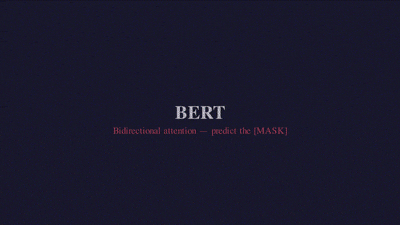
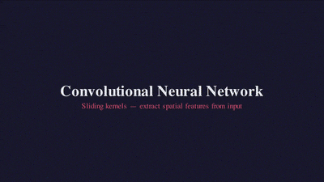
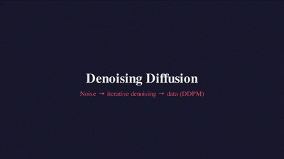
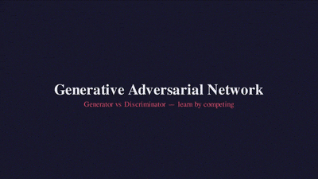
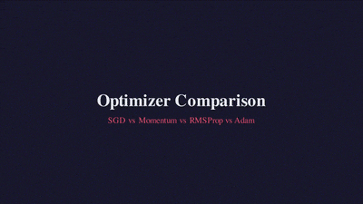
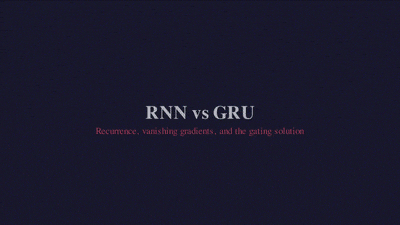
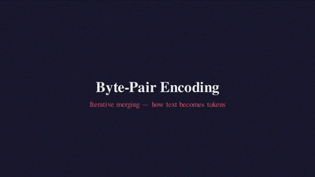
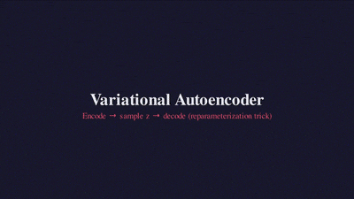

# Foundations

Core algorithms that form the building blocks of modern AI systems. These are the primitives — if you understand these, everything else is composition.

## Scripts

Measured on Apple M-series, Python 3.12. Times are wall-clock.

| Script              | Algorithm                                                                 | Time    | Status | Video                                             |
| ------------------- | ------------------------------------------------------------------------- | ------- | ------ | ------------------------------------------------- |
| `microbert.py`      | Bidirectional transformer encoder (BERT) with masked language modeling    | 4m 34s  | Pass   |       |
| `microconv.py`      | Convolutional Neural Network — kernels, pooling, and feature maps         | 0m 31s  | Pass   |       |
| `microdiffusion.py` | Denoising diffusion on 2D point clouds                                    | 0m 41s  | Pass   |  |
| `microembedding.py` | Contrastive embedding learning (InfoNCE)                                  | 0m 44s  | Pass   |  |
| `microgan.py`       | Generative Adversarial Network — generator vs. discriminator minimax game | 2m 02s  | Pass   |        |
| `microgpt.py`       | Autoregressive language model (GPT) with scalar autograd                  | 1m 41s  | Pass   |        |
| `microoptimizer.py` | Optimizer comparison — SGD vs. Momentum vs. RMSProp vs. Adam              | 0m 34s  | Pass   |  |
| `microrag.py`       | Retrieval-Augmented Generation (BM25 + MLP)                               | 12m 30s | Pass   |        |
| `micrornn.py`       | Vanilla RNN vs. GRU — vanishing gradients and gating                      | 18m 30s | Pass   |        |
| `microtokenizer.py` | Byte-Pair Encoding (BPE) tokenization                                     | 0m 12s  | Pass   |  |
| `microvae.py`       | Variational Autoencoder with reparameterization trick                     | 1m 31s  | Pass   |        |

## Future Candidates

These algorithms are strong candidates for future addition. Each would need to meet the project constraints (single file, zero dependencies, trains and infers, under 10 minutes on CPU).

| Algorithm    | What It Would Teach                                 | Notes                                                          |
| ------------ | --------------------------------------------------- | -------------------------------------------------------------- |
| **LSTM**     | Long Short-Term Memory gating (3 gates vs. GRU's 2) | Could extend micrornn.py or be standalone                      |
| **Word2Vec** | Skip-gram with negative sampling                    | Classic embedding algorithm, simpler than contrastive learning |

## Learning Path

For a guided walkthrough of the foundations tier, follow this order:

```plaintext
microtokenizer.py   → How text becomes numbers
microembedding.py   → How meaning becomes geometry
microgpt.py         → How sequences become predictions
micrornn.py         → How sequences were modeled before attention
microconv.py        → How spatial features get extracted by sliding kernels
microbert.py        → How bidirectional context differs from autoregressive
microrag.py         → How retrieval augments generation
microoptimizer.py   → How optimizer choice shapes convergence
microgan.py         → How two networks learn by competing
microdiffusion.py   → How data emerges from noise
microvae.py         → How to learn compressed generative representations
```
